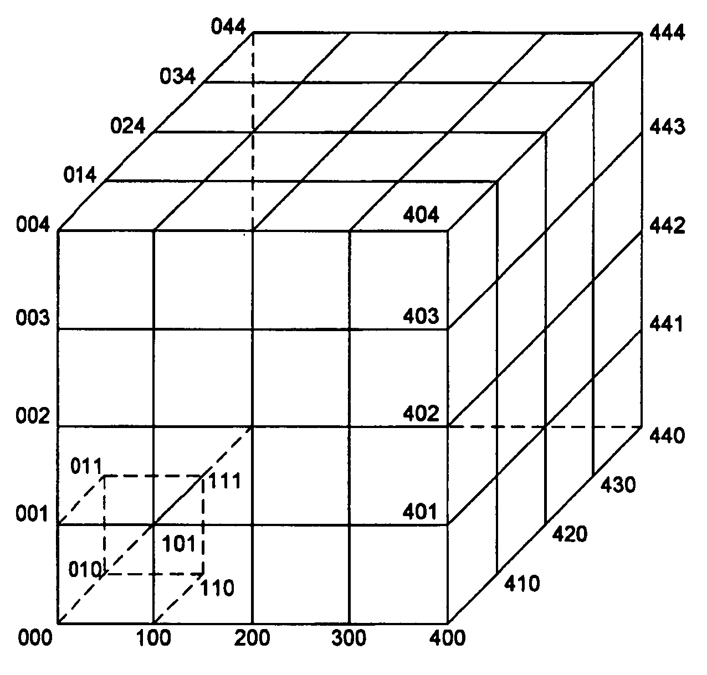

## Key Concept

We introduce the notion of **$$D$$-grid** representation, where **$$D$$** is the grid dimension, for the purpose of parametric studies. This formalism is a methodological effort and contribution to the field of parametric design and analysis.

We model the set of combinations of input values as a $$D$$-grid. A $$D$$-grid is a $$D$$-dimensional grid generated by $$D$$ **finite and strictly ordered sets**, where each grid **dimension** corresponds to a **variable parameter** of the study. The finite number of states that a (scalar) parameter can have, and where the system is to be evaluated, are stacked in ascending order into a set.

We found that the proper comprehension of this object, as detailed below, leads to a solid and generic methodology to organize and conduct a parametric study. It structures the way results can be browsed and interpolated over the parametric space.

<figure>

<figcaption>3-dimensional grid representing a parametric space generated by 3 parameters.</figcaption>

</figure>
