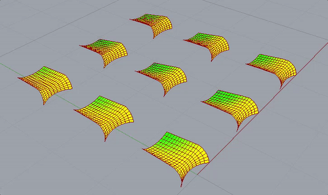
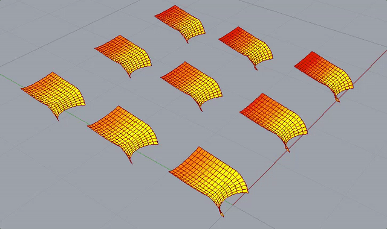
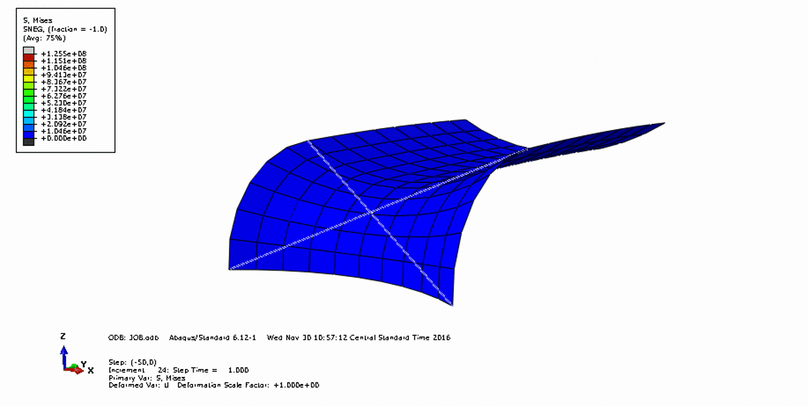

## Case Study

This generic tool is used for an actual parametric study on **shading devices** to explore the behavior of some doubly curved shells actuated by two linear jacks. The idea is to indentify new kinds of shading panels that can lead to a better shading efficiency to increase buildings environmental performance.

1. The parametric design space is modeled as a multidimensional grid with `Ivy`
2. Shapes are generated within *Grasshopper* over the **geometry subspace**
3. Load cases are generated within *Grasshopper* over the **actuation subspace**
4. Input files for *Abaqus* are generated simultaneously within *Grasshopper*
5. Analysis are batch rendered in *Abaqus* (this process can be triggered within *Grasshopper*)
6. Results are collected in a *SQLite* database
7. Results are loaded back into *Grasshopper* to be browsed, interpolated, visualized and analyzed

#### Asymmetric Actuation

#### Symmetric Actuation

### Structural Analysis

