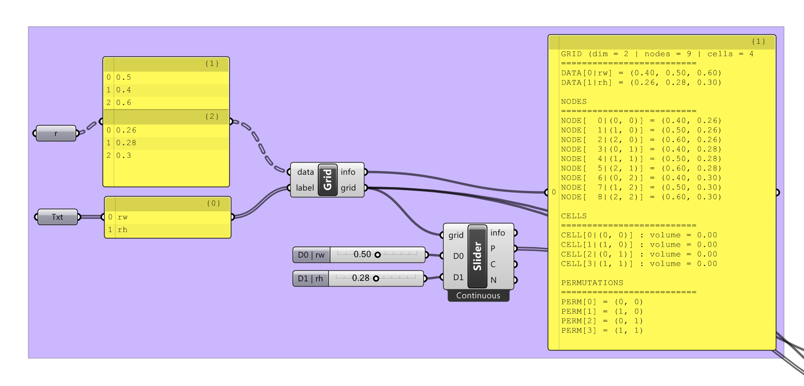

## Tool

In practice, `Ivy` is a `.NET` library written in `C#` which comes out as 2 `dlls`:

* `IvyCore.dll` : the core library
* `IvyGh.gha` : an interface for [Grasshopper](http://www.grasshopper3d.com), a parametric design software

