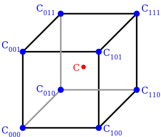

## Cell

A $$D$$-grid can be decomposed in a group of $$D$$-cells called **cell**. Grids and cells are objects of the same topolgy. A cell can bee seen as the smallest possible grid in terms of vertices.

Let a **cell** be an element of the grid. It can be seen as a d-tuple of the form :

A $$D$$-cell is itself a **hyper rectangle** also known as a  [**d-orthotope**](https://www.wikiwand.com/en/Hyperrectangle).

<figure>

<figcaption>Relative numbering of nodes in a 3-cell.</figcaption>

</figure>

### Cell Count

The total number of cells in a grid is given by :

$$
N_C 	= (N_1-1) \times (N_2-1) \times \cdots \times (N_{D}-1)
$$

### Indexing

Each cell is **indexed** relatively to its **origin node** :
$$
  n_{i^1i^2~\cdots~i^{D}} \Rightarrow c_{i^1i^2~\cdots~i^{D}}
  ~~,~~ i^j \in [1,N_j-1] ~~,~~ j \in [1,D]
$$

And, like nodes, **cells** can be indexed regarding their tuple address.

### Corner Nodes

The number of corners in a cell is :

$$
2^D
$$

**Corner nodes** ar obtained by a set of **permutations** about the origin :

$$
\begin{array}{r|cccc}
Origin        & i^1       & i^1     & i^2     & \cdots  & i^{D}     \\
\\
              & +       	& +     	& +     	& \cdots  & +     		\\
                                                                    \\
k             & \sigma_k(i^1) & \sigma_k(i^1)  & \sigma_k(i^3) & \cdots  & \sigma_k(i^D)
\end{array}
$$

$$
\\
\sigma_k(i^j) \in \{0,1\} ~~,~~ i^j \in [1,N_j-1] ~~,~~ j \in [1,D] ~~,~~ k \in [1,2^D]
$$

Thus :

$$
\begin{array}{r|cccc}
Origin        & i^1       & i^1     & i^2     & \cdots  & i^{D}     \\
              & +       	& +     	& +     	& \cdots  & +     		\\
1             & 0        	& 0      	& 0      	& \cdots  & 0         \\
2             & 1        	& 0      	& 0      	& \cdots  & 0         \\
3             & 0        	& 1      	& 0      	& \cdots  & 0         \\
4             & 1        	& 1      	& 0      	& \cdots  & 0         \\
5             & 0        	& 0      	& 1      	& \cdots  & 0         \\
6             & 1        	& 0      	& 1      	& \cdots  & 0         \\
7             & 0        	& 1      	& 1      	& \cdots  & 0         \\
8             & 1        	& 1      	& 1      	& \cdots  & 0         \\
              & \vdots    & \vdots  & \vdots  &         & \vdots		\\
2^D           & 1        	& 1      	& 1      	& \cdots  & 1
\end{array}
$$

> Note that this procedure respect the way we ordered all the nodes of the grid ; so they are also sorted in ascent order this way.
